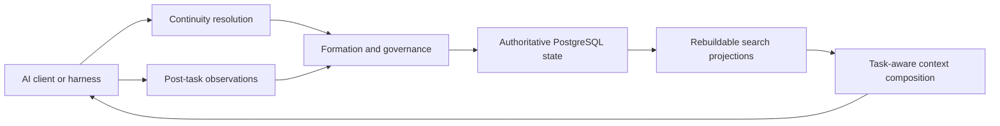

# Vermory

**Governed Memory for AI**

[](https://github.com/jstar0/Vermory/actions/workflows/ci.yml)
[](LICENSE)

[Chinese documentation](README.zh-CN.md)

Vermory is a reality-first memory and context continuity platform for AI clients. It is designed for coding agents, web chat, assistants, and other tools that need to continue real work without mixing unrelated projects, reviving stale facts, or turning every conversation into permanent memory.

Vermory is more than a memo store. Its core problem is deciding:

- which continuity the current interaction belongs to;
- which observations deserve durable memory;
- which source is authoritative when facts conflict;
- which facts are current, superseded, local, global, or deleted;
- what context a specific AI task should receive;
- how every formation, correction, recall, bridge, and deletion remains explainable.

## Continuity Model

Vermory organizes continuity by anchor strength rather than by arbitrary content categories.

| Mode | Anchor | Expected behavior |
|---|---|---|
| Workspace-backed continuity | Repository root, workspace path, manifest, explicit workspace binding | The same workspace can continue across supported coding clients; different workspaces remain isolated. |
| Conversation-backed continuity | Thread, channel, contact, named matter, explicit topic | Everyday matters can continue across conversations without merging unrelated topics. |
| Global Defaults | Explicit stable user preferences and long-lived settings | A deliberately thin layer; temporary task instructions must not silently become permanent defaults. |

Cross-mode operations such as promote, link, export, adopt, and rebind are governed bridge actions, not implicit mixing.

## Product Invariants

The current constitution requires:

- zero forbidden cross-tenant and cross-continuity leakage in labeled hard-gate cases;
- no automatic strong-anchor merge when binding is ambiguous;
- no stale or superseded fact represented as current;
- no deleted target returned through exact, paraphrased, semantic, cached, historical, or adapter-backed recall;
- live repository and source reality can correct stale descriptive memory;
- model inference cannot silently override explicit user intent;
- PostgreSQL remains authoritative while search projections stay disposable and rebuildable;
- mem0, MemOS, Supermemory, and future systems remain optional projection adapters rather than second sources of truth.

See the [Product Constitution](docs/superpowers/specs/2026-07-11-vermory-product-constitution.md).

## Current Status

Vermory is in evidence-driven development.

Experiment 0 is complete. It provides:

- a strict reality-case manifest and JSONL event contract;
- source authorization, anonymization, fixture hashing, and path containment checks;
- deterministic `fixture-lock.json` generation and mutation detection;
- public and `withheld_local` evidence levels without fake local sealing;
- Ed25519 verification for attestations received from an external sealed evaluator;
- nine frozen public cases covering workspace continuity, conversation continuity, Global Defaults, deletion, source injection, durable bridges, OpenClaw everyday-use continuity, authenticated multi-tenant RLS, and PostgreSQL operations recovery;
- JSON and Markdown Experiment 0 reports.

The repository also contains production-shaped runtime slices for workspace and conversation continuity, Global Defaults, durable bridges, explicit source-authoritative revision, the OpenClaw external-turn lifecycle, an authenticated multi-tenant HTTP profile, native PostgreSQL recovery, and a qualified original LongMemEval oracle sample. The source-revision slice replaces one named active fact, preserves unrelated facts and history, excludes stale content after projection rebuild, and has been consumed through a real Grok MCP task. The authenticated profile uses server-issued digest-only tokens, role-gated routes, a non-owner PostgreSQL runtime identity, tenant-aware foreign keys, and RLS on the served continuity graph. Recovery evidence covers migration replay, native dump/restore, projection rebuild, runtime-role re-provisioning, and bounded database outage recovery. The LongMemEval evidence runs six official records through no-context, full-history, plain-retrieval, and production Vermory-packet conditions with a real Grok reader; it is reported as `dataset_sample`, not a full benchmark score. Each evidence document is scoped to the exact client, model, failure mode, and deterministic hard gates it executed; no individual slice is treated as proof that the complete platform is finished.

Read the [Experiment 0 report](docs/experiment-0-readout.md).

## Architecture Direction



The final physical schema, memory taxonomy, lifecycle names, ranking algorithm, API shape, SLOs, and scale profile are intentionally not frozen yet. They remain falsifiable hypotheses until real trajectories discriminate them.

## Quick Start

Requirements:

- Go `1.25.7` or a compatible newer toolchain;
- `jq` for inspecting generated evidence;
- PostgreSQL only for commands that exercise the native backend or legacy vertical slice.

Run the test suite:

```bash
go test ./...
go test -race ./internal/reality
go vet ./...
```

Inspect the CLI:

```bash
go run ./cmd/vermory --help
```

Validate the frozen public cases:

```bash
go run ./cmd/vermory reality-validate \
  --case-root reality/cases \
  --artifact-root ./artifacts \
  --run-id experiment-0-public-v1
```

Generate the Experiment 0 readout:

```bash
go run ./cmd/vermory experiment-0 \
  --case-root reality/cases \
  --artifact-root ./artifacts \
  --run-id experiment-0-v1
```

Generated artifacts are written below `artifacts/` and are intentionally not committed.

Trusted local ingestion can replace one named active fact with a newer source
revision without overwriting unrelated workspace memory:

```bash
go run ./cmd/vermory memory revise-source \
  --database-url "$VERMORY_DATABASE_URL" \
  --tenant-id local \
  --repo-root /absolute/workspace \
  --operation-id release-manifest-v2 \
  --memory-id '<superseded-memory-id>' \
  --source-ref repo:release-manifest@v2 \
  --content 'Use pnpm exec release:verify --mode locked.'
```

`revise-source` records source authority. `memory correct` remains the separate
user-authoritative correction path. Neither command guesses a target from
semantic similarity.

See [Explicit Source Revision Runtime Evidence](docs/evidence/2026-07-14-source-revision-runtime.md)
for the frozen software-release case, PostgreSQL lifecycle and rebuild gates,
real Grok MCP replay, preserved Codex quota/model failures, and exact claim
boundary.

Run the qualified LongMemEval oracle sample after obtaining the official source
artifact and preparing a dedicated PostgreSQL database:

```bash
go run ./cmd/vermory benchmark-longmemeval \
  --database-url "$VERMORY_BENCHMARK_DATABASE_URL" \
  --source-dataset /path/to/longmemeval_oracle.json \
  --provider grok-cli \
  --model grok-4.5 \
  --implementation-revision "$(git rev-parse HEAD)" \
  --run-id longmemeval-original-sample
```

See [LongMemEval Original-Dataset Sample Evidence](docs/evidence/2026-07-14-longmemeval-original-sample.md).

## OpenClaw Integration

The local workspace MCP path has also been executed by the official Codex CLI. Codex called `prepare_context`, created and verified a repository artifact from the governed current fact, and called `commit_observation`; PostgreSQL retained the write-back as `proposed`. See [Codex MCP Real-Client Evidence](docs/evidence/2026-07-14-codex-mcp-real-client.md).

The `@vermory/openclaw` lifecycle plugin uses OpenClaw's canonical `sessionKey` and `runId`, injects governed semantic context during `before_prompt_build`, and records the final turn lifecycle during `agent_end`. It does not replace OpenClaw transcript storage, memory slots, channels, or model routing.

Build and check the plugin:

```bash
PATH="/opt/homebrew/opt/node@24/bin:$PATH" \
  pnpm -C integrations/openclaw install --frozen-lockfile
PATH="/opt/homebrew/opt/node@24/bin:$PATH" \
  pnpm -C integrations/openclaw check
```

See the [OpenClaw runtime integration guide](docs/integrations/openclaw-runtime.md) for loopback deployment, trust configuration, runtime inspection, governance actions, failure behavior, isolated-state replay, and uninstall steps.

For authenticated deployment, token lifecycle, runtime-role provisioning, TLS rules, RLS verification, backup, restore, projection rebuild, and revocation, see [Identity, Authorization, And PostgreSQL RLS](docs/integrations/identity-authorization-rls.md). The [identity evidence](docs/evidence/2026-07-14-identity-authorization-rls.md) includes deterministic tenant-isolation gates and a real authenticated OpenClaw/Grok replay; the [operations recovery evidence](docs/evidence/2026-07-14-postgresql-operations-recovery.md) records native dump/restore, projection loss/rebuild, and database outage recovery.

## Repository Layout

```text
cmd/vermory/              CLI entry point
internal/reality/         Reality evidence, freeze, validation, attestation, readout
reality/cases/            Frozen public reality trajectories
reality/schema/           Machine-readable case and attestation schemas
internal/memorybackend/   Native and optional retrieval projection adapters
internal/resolver/        Workspace, conversation, and Global Defaults resolution
internal/governance/      Existing governed-claim vertical-slice services
internal/bridge/          Promote, link, export, adopt, and rebind primitives
casebook/                 Historical ContextMesh compatibility harness
docs/                     Constitution, Reality Program, ADRs, evidence, and plans
```

Historical `ContextMesh` case IDs, artifact names, and database identifiers remain stable evidence identifiers unless an explicit migration changes them.

## Evidence-First Development

New permanent architecture should follow this order:

```text
real failure or trajectory
-> frozen current and forbidden behavior
-> public and withheld evaluation evidence
-> comparable baselines
-> implementation hypothesis
-> real client execution
-> failure, deletion, migration, and scale verification
```

Do not add a new schema entity, service, lifecycle state, provider dependency, or release metric only because it appears architecturally complete. Map it to a falsifiable hypothesis and a real case first.

## Backend Decision

The current native deployment decision is PostgreSQL plus pgvector. Existing backend evidence also covers mem0, MemOS, and Supermemory adapters.

The backend bake-off proves the tested retrieval and lifecycle adapter contract only. It does not prove end-to-end formation, continuity resolution, context utility, real-client integration, or sealed quality.

See [Backend Bake-Off Results](docs/backend-bakeoff-results.md).

## Contributing

Read [CONTRIBUTING.md](CONTRIBUTING.md) before submitting code or evidence. Reality cases must never include credentials, private raw transcripts, unredacted personal paths, or a false `sealed` label.

Security reports should follow [SECURITY.md](SECURITY.md).

## License

Licensed under the [Apache License 2.0](LICENSE).
